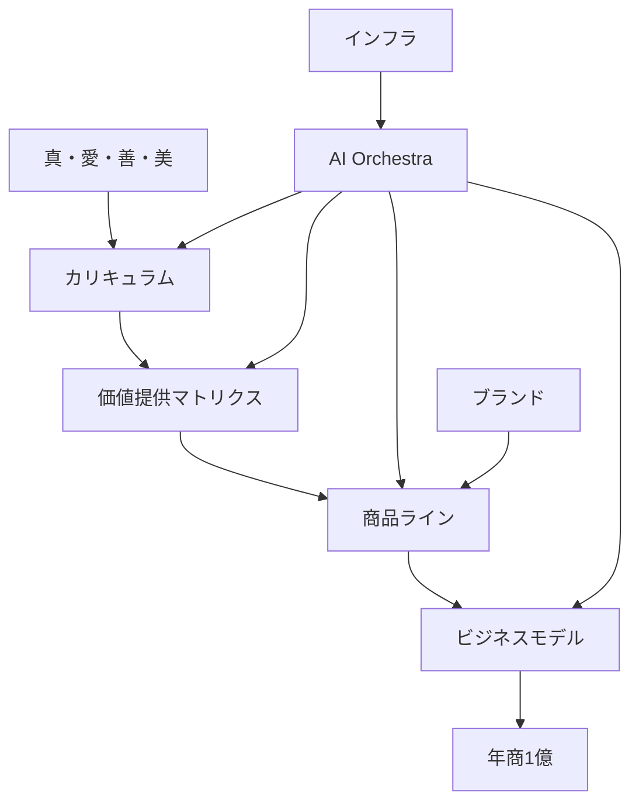

# 📊 Taka Future Dashboard
## GitHub Projects Dashboard Template

**作成日**: 2025-12-11

---

## 🎯 Epic進捗状況

### Taka Future Orchestration System

**ステータス**: 🟡 In Progress  
**完了率**: 0/7 (0%)

**進捗バー**:
```
[░░░░░░░░░░░░░░░░░░░░] 0%
```

---

## 📌 Issue進捗

### Issue 1: Curriculum Master System 実装
- **ステータス**: ⏳ Pending
- **進捗**: 0%
- **担当**: TBD

### Issue 2: Value Proposition Matrix 実装
- **ステータス**: ⏳ Pending
- **進捗**: 0%
- **担当**: TBD

### Issue 3: Business Architecture Map 実装
- **ステータス**: ⏳ Pending
- **進捗**: 0%
- **担当**: TBD

### Issue 4: AI Orchestra System Blueprint 実装
- **ステータス**: ⏳ Pending
- **進捗**: 0%
- **担当**: TBD

### Issue 5: Infrastructure Setup 実装
- **ステータス**: ⏳ Pending
- **進捗**: 0%
- **担当**: TBD

### Issue 6: Brand Bible 実装
- **ステータス**: ⏳ Pending
- **進捗**: 0%
- **担当**: TBD

### Issue 7: Integrated System Map 実装
- **ステータス**: ⏳ Pending
- **進捗**: 0%
- **担当**: TBD

---

## 🗺️ システム全体の可視化

### 統合システムマップ



---

## 💎 価値の流れの可視化

### Resonance Nodes（価値増幅ポイント）

1. **Node 1: カリキュラム × 商品**
   - カリキュラムの価値が商品に反映
   - 商品を通じてカリキュラムの価値が体験

2. **Node 2: 商品 × ビジネス**
   - 商品の価値がビジネスモデルに反映
   - ビジネスモデルを通じて商品の価値が拡大

3. **Node 3: ビジネス × AI Orchestra**
   - ビジネスの価値がAI Orchestraによって増幅
   - AI Orchestraを通じてビジネスの効率が向上

4. **Node 4: AI Orchestra × カリキュラム**
   - AI Orchestraの価値がカリキュラムに反映
   - カリキュラムを通じてAI Orchestraの価値が伝わる

---

## ⏰ Takaさんの時間配分モデル

### 優先順位別時間配分

| 優先度 | 活動 | 時間配分 | 時間/週 |
|--------|------|----------|---------|
| P1 | 魂の核を見抜く力の実践 | 40% | 16時間 |
| P2 | 世界観の言語化と伝達 | 20% | 8時間 |
| P3 | 最終判断と承認 | 20% | 8時間 |
| P4 | 戦略と方向性の決定 | 20% | 8時間 |

### 時間削減目標

- **現在**: 100%
- **目標**: 30%
- **削減**: 70%（AI Orchestraによる自動化）

---

## 📈 売上予測

### 基本予測

| 年 | 予測売上 |
|----|----------|
| Year 1 | ¥30,000,000 |
| Year 2 | ¥60,000,000 |
| Year 3 | ¥100,000,000 |

### 成長シナリオ

- **楽観的**: +20%
- **基本**: 基準
- **保守的**: -20%

---

## 🎯 次のマイルストーン

1. **Week 1-2**: インフラセットアップ完了
2. **Week 3-4**: カリキュラムシステム実装完了
3. **Week 5-6**: 価値提供マトリクス実装完了
4. **Week 7-8**: ビジネス構造実装完了

---

**最終更新**: 2025-12-11

